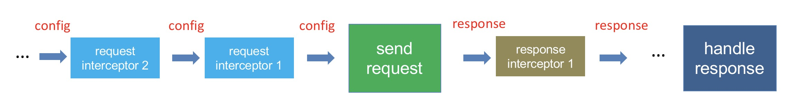

# 请求和响应拦截器

请求拦截器就是可以在每个请求发送之前为请求做一些额外的东西。
响应拦截器就是当每个请求的响应回来之后我们可以先对其进行一道预处理，处理后再将响应返回给真正的请求。

并且可以添加多个拦截器，拦截器的执行顺序是链式依次执行的。
- 对于`request` 拦截器，后添加的拦截器请求时先执行，处理config 对象
- 对于`response` 拦截器，先添加的拦截器响应时先执行，处理response 对象

`axios.interceptors.request` 和`axios.interceptors.response` 都有添加拦截器的use方法和删除拦截器的eject方法。

use 方法支持2 个参数，一个resolve 函数，一个reject 函数
- 对于resolve 函数的参数，请求拦截器是`AxiosRequestConfig` 类型，响应拦截器是`AxiosResponse` 类型
- 对于reject 函数的参数类型是`any` 类型

# 拦截器链式调用

1. 创建一个数组初始时，将`send request` 放入
2. 遍历`axios.interceptors.request` 将请求拦截器unshift 放入数组
3. 遍历`axios.interceptors.response` 将响应拦截器push 放入数组
